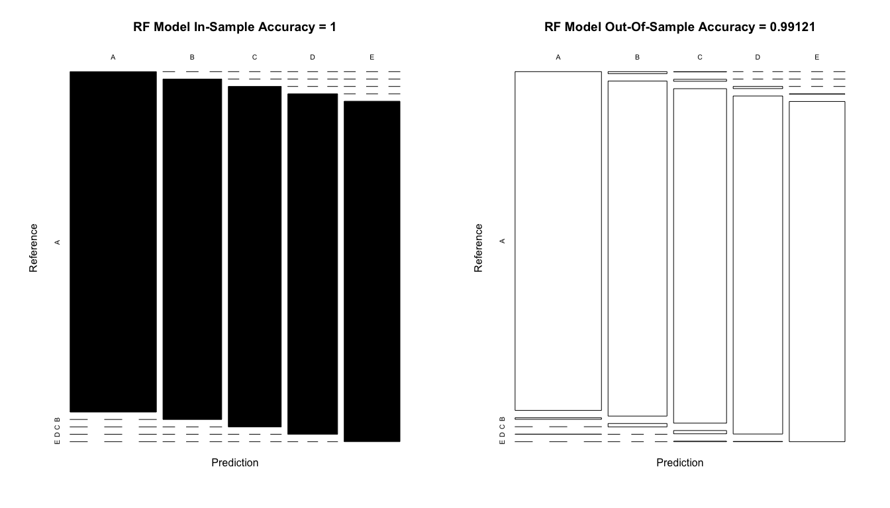

# PML Project: Human Activity Recognition
Ray Jones  
22nd November, 2015  


### Executive Summary
This document has been prepared as a submission in response to the Project requirements for the Practical Machine Learning (PML) module of the Coursera/Johns Hopkins Data Science Specialization. The aim of the project was to train a machine learning (ML) algorithm to analyse a data set consisting of quantified self movement measurements collected from accelerometers worn by a number of people during exercises. After initialization and pre-processing of the data, a number of different ML algorithms were trained and their in-sample performances assessed. On this basis, the best ML algorithm was selected and subjected to out-of-sample performance assessment. The selected ML algorithm was then used to generate a prediction of how well the exercises were performed for $20$ blind test cases. This prediction was submitted for grading and a $100\%$ accuracy level was achieved using the randomForest ML algorithm.

### Exploratory Analysis & Data Pre-processing
The data sets for this project are available from https://d396qusza40orc.cloudfront.net/predmachlearn/ - they consist of pml-training.csv which includes the training/testing data and pml-testing.csv which includes the 20 blind test cases for the project submission. Full instructions on this project are available at https://class.coursera.org/predmachlearn-034/human_grading/view/courses/975204/assessments/4/submissions - the collection and original analysis of this data set are described in a paper[^1] available online from http://groupware.les.inf.puc-rio.br/har .

[^1]: Velloso, E.; Bulling, A.; Gellersen, H.; Ugulino, W.; Fuks, H. Qualitative Activity Recognition of Weight Lifting Exercises. Proceedings of 4th International Conference in Cooperation with SIGCHI (Augmented Human '13) . Stuttgart, Germany: ACM SIGCHI, 2013.

The code chunk below loads the various required libraries and then sets the random number seed in order to make the processing reproducible. It then sets the working directory and loads the two data files required.


```r
## Install the required libraries for the analysis
library(caret, quietly=T);library(parallel, quietly=T);library(doParallel, quietly=T);library(knitr, quietly=T)
library(caTools, quietly=T);library(rpart, quietly=T);library(ipred, quietly=T);library(plyr, quietly=T)
library(survival, quietly=T);library(splines, quietly=T);library(MASS, quietly=T); library(kernlab, quietly=T)
library(gbm, quietly=T);library(randomForest, quietly=T)

## Set the random number seed to make this all reproducible
set.seed(1221)

## Set the working directory and then load the required data files
dirPath             <- "~/Documents/Data Science Specialisation/8 - Practical Machine Learning/Project"
setwd(dirPath)
dataSet 			<- read.csv("pml-training.csv", na.strings = c("NA", "#DIV/0!", ""))
submissionCases 	<- read.csv("pml-testing.csv", na.strings = c("NA", "#DIV/0!", ""))
```

The next code chunk prints out the dimensions of the two data sets - (i) dataSet, which contains the data for the training and testing of the ML algorithms and (ii) submissionCases, which contains the $20$ individual observations used for the blind prediction performance testing submitted for grading. This chunk also examined the structures of the two data sets but these lines were subsequently removed as the outputs were very verbose. In the original analysis the data were treated as time series. However, this was not an option for this exercise as the $20$ blind test cases were supplied out of context (ie without histories or future samples) so the analysis reported here was done on the basis of the instantaneous measurement values and not via time-slicing. 


```r
## Exploratory data analysis
output 				<- rbind(dim(submissionCases), dim(dataSet))
colnames(output) 	<- c("Observations", "Variables")
rownames(output) 	<- c("Submission Cases", "Training/testing Data")
kable(output)
```

                         Observations   Variables
----------------------  -------------  ----------
Submission Cases                   20         160
Training/testing Data           19622         160

The next step was to remove the first seven variables from each data set, as they contain values added to the raw measurement data during the original analysis which were not relevant to the analysis here. Following this, variables with incomplete (missing) measurements were identified and removed (as these were also added during the original analysis, missing samples generally being a consequence of the time windowing imposed during that analysis). The final step carried out on the combined training/tesing data was to partition it into training and testing sets on the basis of an 80%:20% random selection.


```r
## Remove irrelevant and empty variables
dataSet 			<- dataSet[,-c(1:7)]
submissionCases 	<- submissionCases[,-c(1:7)]
dataSet 			<- dataSet[,colSums(is.na(dataSet)) == 0]
submissionCases 	<- submissionCases[,colSums(is.na(submissionCases)) == 0]

## Partition the dataSet into 80% training and 20% test data sets
intrain 			<- createDataPartition(dataSet$classe, p = 0.80, list = FALSE)
training 			<- dataSet[intrain,]
testing 			<- dataSet[-intrain,]
output 				<- rbind(dim(testing), dim(training))
colnames(output) 	<- c("Observations", "Variables")
rownames(output) 	<- c("Testing data", "Training data")
kable(output)
```

                 Observations   Variables
--------------  -------------  ----------
Testing data             3923          53
Training data           15699          53

Next, in order to reduce the computational load involved in ML algorithm training, pairs of strongly correlated variables were identified using the findCorrelations() function in the training data set only and one of each pair was removed from each of the training, testing and submission case data sets (since one of each pair was redundant as a predictor due to the correlation). This was done on the basis of correlations identified in the training data only in order to preserve the Out-Of-Sample (OOS) nature of the testing set. The dimensions of the resulting data sets were then printed. 


```r
## Find strongly correlated variables & remove from data sets
correlations 		<- findCorrelation(cor(training[,1:52]), cutoff=0.8)
training 			<- training[,-c(correlations)]
testing 			<- testing[,-c(correlations)]
submissionCases 	<- submissionCases[,-c(correlations)]
output 				<- rbind(dim(submissionCases), dim(testing), dim(training))
colnames(output) 	<- c("Observations", "Variables")
rownames(output) 	<- c("Submission Cases", "Testing Data", "Training Data")
kable(output)
```

                    Observations   Variables
-----------------  -------------  ----------
Submission Cases              20          40
Testing Data                3923          40
Training Data              15699          40

As a final check, an assessment was carried out to establish that no zero or near zero variance predictors were present in the final filtered data sets (since predictors that don't change value over the data set are not likely to be useful as predictors) - this was confirmed. 


```r
## Confirm absence of zero & near zero variance terms
training_nzv 		<- nearZeroVar(training, saveMetrics = TRUE)
testing_nzv 		<- nearZeroVar(testing, saveMetrics = TRUE)
submissionCases_nzv <- nearZeroVar(submissionCases, saveMetrics = TRUE)
output 				<- rbind(cbind(sum(as.numeric(submissionCases_nzv$zeroVar)), 
						  		   sum(as.numeric(submissionCases_nzv$nzv))), 
							 cbind(sum(as.numeric(testing_nzv$zeroVar)), 
							 	   sum(as.numeric(testing_nzv$nzv))),
							 cbind(sum(as.numeric(training_nzv$zeroVar)), 
							 	   sum(as.numeric(training_nzv$nzv))))

colnames(output) 	<- c("Zero Variance", "Near Zero Variance")
rownames(output) 	<- c("Submission Cases", "Testing Data", "Training Data")
kable(output)
```

                    Zero Variance   Near Zero Variance
-----------------  --------------  -------------------
Submission Cases                0                    0
Testing Data                    0                    0
Training Data                   0                    0

As can be seen above, after pre-processing the data sets consist of $40$ variables. In the training & testing sets this includes the $classe variable which contains the truth for the quality of exercise performance. In submissionCase the $classe variable is absent, replaced by a test id no. (ie for the submissionCases the actual truth data is unknown a-priori and hence these test cases are blind).  

### Model Training
As the next step, the code chunk below was used to train a total of eight different methods interfaced from within the R {caret} package using the training sub-set of the partitioned data set. The {caret}train() method automatically included an element of cross-validation against suitably sub-setted training data as part of the training process. But it should be noted that this is quite distinct from the explicit testing manually carried out and documented below (against the testing sub-set of the partitioned data), which supported the a-priori estimation of the out-of-sample performance accuracy for the blind submission test cases (recall that error = 1 - accuracy).

The ML algorithms trained were selected to cover a range of different approaches and so maximise the probability of discovering an optimal approach. This process was initially found to be extremely computationally demanding, eg, the initial runs of this script required in excess of 4 hours to complete. As part of the optimisation of the code a number of strategies were investigated. The following optimisations were finally implemented after significant experimentation:

* For all MLs, the default {caret}train() bootstrap re-sampling process was replaced by a 3-fold cross-validation which had no impact on accuracy but significantly speeded up the execution (using {caret}trainControl() parameters "method" & "number").  
* For the random forest ML algorithm, the default selection of no of predictors/3 for the no. of predictors randomly selected at each node splitting step of the tree was replaced by 6 (parameter "mtry").
* The multi-core nature of the machine used to execute the script was exploited by turning on parallel processing using the {doParallel}registerDoParallel() routine. This was found to give a significant speed boost during execution.

The steps outlined above were very successful and reduced the elapsed time required for executing this script from > 4 hours to < 10 minutes.

The eight ML algorithms selected for training and later cross comparison of in-sample results were:  

* Random Forest (rf)  
* Recursive Partioning & Regression Trees (rpart)  
* Bagged Trees (treebag)  
* Boosted Trees (gbm)  
* Linear Discriminant Analysis (lda)  
* Support Vector Machines - Linear (svmLinear)  
* Support Vector Machines - Radial (svmRadial)  
* Logit Boost Classification (LogitBoost)  

For further discussion of the details of any of these ML algorithms the reader is referred to the relevant R documentation (typing ?method_name at the R command prompt - after the relevant libraries have been loaded).


```r
## Set up parallel processing in order to speed optimize
cluster 			<- makeCluster(detectCores() - 1)
registerDoParallel(cluster)

## Train candidate models
fitControl 			<- trainControl(method = "cv", number = 3, verboseIter = FALSE)
tgrid 				<- expand.grid(mtry=c(6)) 
model_rf 			<- train(classe ~ ., data=training, method="rf", trControl=fitControl, tuneGrid=tgrid)
model_rpart			<- train(classe ~ ., data=training, method="rpart", trControl=fitControl)
model_treebag		<- train(classe ~ ., data=training, method="treebag", trControl=fitControl)
model_gbm 			<- train(classe ~ ., data=training, method="gbm", trControl=fitControl, verbose=FALSE)
model_lda			<- train(classe ~ ., data=training, method="lda", trControl=fitControl)
model_svml			<- train(classe ~ ., data=training, method="svmLinear", trControl=fitControl)
model_svmr 			<- train(classe ~ ., data=training, method="svmRadial", trControl=fitControl)
model_LogitBoost 	<- train(classe ~ ., data=training, method="LogitBoost", trControl=fitControl)

## turn off parallel processing
stopCluster(cluster)
```

### Cross-Validation & Expected Out-Of-Sample Error
The next code chunk compared the performances of the various ML algorithms used by assembling and printing a table of the in-sample accuracies achieved by each of the ML algorithms after using the trained models to predict the $classe results for the training data sub-set and comparing them to the actual $classe variables using the {caret}confusionMatrix() routine. Recall that the error rate is simply 1 - accuracy.


```r
## Compare & print candidate model training accuracy results
output 				<- round(rbind(confusionMatrix(predict(model_rf, training), training$classe)$overall[1:4],
	  						confusionMatrix(predict(model_rpart, training), training$classe)$overall[1:4],
	  						confusionMatrix(predict(model_treebag, training), training$classe)$overall[1:4],
	  						confusionMatrix(predict(model_gbm, training), training$classe)$overall[1:4],
	  						confusionMatrix(predict(model_lda, training), training$classe)$overall[1:4],
	  						confusionMatrix(predict(model_svml, training), training$classe)$overall[1:4],
	  						confusionMatrix(predict(model_svmr, training), training$classe)$overall[1:4],
	  					confusionMatrix(predict(model_LogitBoost, training), training$classe)$overall[1:4]),5)
rownames(output) 	<- c("rf", "rpart", "treebag", "gbm", "lda", "svmLinear", "svmRadial", "LogitBoost")
kable(output)
```

              Accuracy     Kappa   AccuracyLower   AccuracyUpper
-----------  ---------  --------  --------------  --------------
rf             1.00000   1.00000         0.99977         1.00000
rpart          0.47493   0.31309         0.46710         0.48278
treebag        0.99987   0.99984         0.99954         0.99998
gbm            0.96509   0.95584         0.96210         0.96791
lda            0.64679   0.55365         0.63926         0.65427
svmLinear      0.70960   0.63034         0.70243         0.71669
svmRadial      0.93324   0.91539         0.92923         0.93710
LogitBoost     0.89609   0.86660         0.89078         0.90123

From the results presented in the table above, it is clear that the random forest (rf) and bagged trees (treebag) algorithms gave the best results with in-sample accuracies at or near $100\%$ (ie $0\%$ in-sample error rate). The boosted trees (gbm) and support vector machines - radial (svmr) algorithms both gave in-sample accuracies in excess of $90\%$ while all others fell in the range $\approx 45 - 90\%$. Since the highest accuracy was achieved by the random forest algorithm (the same algorithm used in the original research paper), this method was selected for further testing at this point.

Initially the detailed in-sample test results for the random forest algorithm were printed out by the following code chunk using the {caret}confusionMatrix() routine. Then the trained random forest model was used to predict the $classe results for the testing sub-set of the partitioned data and details of the out-of-sample performance (cross-validation) were printed.  Finally a bar chart graphic comparing the in-sample and out-of-sample performances was prepared to allow easy comparison of the results.


```r
## Print out details of selected model training performance
prediction 			<- predict(model_rf, training)
cm_training 		<- confusionMatrix(prediction, training$classe)
cm_training
```

```
## Confusion Matrix and Statistics
## 
##           Reference
## Prediction    A    B    C    D    E
##          A 4464    0    0    0    0
##          B    0 3038    0    0    0
##          C    0    0 2738    0    0
##          D    0    0    0 2573    0
##          E    0    0    0    0 2886
## 
## Overall Statistics
##                                      
##                Accuracy : 1          
##                  95% CI : (0.9998, 1)
##     No Information Rate : 0.2843     
##     P-Value [Acc > NIR] : < 2.2e-16  
##                                      
##                   Kappa : 1          
##  Mcnemar's Test P-Value : NA         
## 
## Statistics by Class:
## 
##                      Class: A Class: B Class: C Class: D Class: E
## Sensitivity            1.0000   1.0000   1.0000   1.0000   1.0000
## Specificity            1.0000   1.0000   1.0000   1.0000   1.0000
## Pos Pred Value         1.0000   1.0000   1.0000   1.0000   1.0000
## Neg Pred Value         1.0000   1.0000   1.0000   1.0000   1.0000
## Prevalence             0.2843   0.1935   0.1744   0.1639   0.1838
## Detection Rate         0.2843   0.1935   0.1744   0.1639   0.1838
## Detection Prevalence   0.2843   0.1935   0.1744   0.1639   0.1838
## Balanced Accuracy      1.0000   1.0000   1.0000   1.0000   1.0000
```

```r
## Use selected model to predict testing results and assess performance
prediction 			<- predict(model_rf, testing)
cm_testing 			<- confusionMatrix(prediction, testing$classe)
cm_testing
```

```
## Confusion Matrix and Statistics
## 
##           Reference
## Prediction    A    B    C    D    E
##          A 1115    4    0    0    0
##          B    1  753    4    0    0
##          C    0    2  680    3    0
##          D    0    0    0  639    3
##          E    0    0    0    1  718
## 
## Overall Statistics
##                                           
##                Accuracy : 0.9954          
##                  95% CI : (0.9928, 0.9973)
##     No Information Rate : 0.2845          
##     P-Value [Acc > NIR] : < 2.2e-16       
##                                           
##                   Kappa : 0.9942          
##  Mcnemar's Test P-Value : NA              
## 
## Statistics by Class:
## 
##                      Class: A Class: B Class: C Class: D Class: E
## Sensitivity            0.9991   0.9921   0.9942   0.9938   0.9958
## Specificity            0.9986   0.9984   0.9985   0.9991   0.9997
## Pos Pred Value         0.9964   0.9934   0.9927   0.9953   0.9986
## Neg Pred Value         0.9996   0.9981   0.9988   0.9988   0.9991
## Prevalence             0.2845   0.1935   0.1744   0.1639   0.1838
## Detection Rate         0.2842   0.1919   0.1733   0.1629   0.1830
## Detection Prevalence   0.2852   0.1932   0.1746   0.1637   0.1833
## Balanced Accuracy      0.9988   0.9953   0.9963   0.9964   0.9978
```

```r
## Plot comparison charts for training and testing performance of selected model
par(mfrow=c(1,2))
plot(cm_training$table, col = cm_training$byClass, main = paste("RF Model In-Sample Accuracy =", 
																round(cm_training$overall['Accuracy'], 5)))
plot(cm_testing$table, col = cm_testing$byClass, main = paste("RF Model Out-Of-Sample Accuracy =", 
																round(cm_testing$overall['Accuracy'], 5)))
```

<p class="caption">*Figure 1: Selected RF Model Performance*</p>

The detailed in-sample results for the random forest method show the very high accuracy performance achieved - $100\%$. As expected, this performance was lower for the out-of-sample (manual cross-validation) testing but nevertheless exceeded $99.5 \%$ accuracy (or $< 0.5\%$ out-of-sample error rate). At this accuracy level, the probability of achieving a perfect score for the $20$ blind test cases was computed as $0.9926^{20} \approx 91.2\%$. But given that $2$ attempts were allowed, the probability that at least one of those attempts would achieve a perfect score was computed as $1-(1-0.912)^{2} \approx 99.2\%$, ie a $99.2\%$ probability of achieving at least one perfect score in the two attempts allowed. On this basis, the decision was taken to proceed with the blind test case submission. Examining Figure 1 shows these very high levels of prediction accuracy graphically. On the the LHS the bar chart shows the perfect results achieved in-sample (hence the bars are shown filled in) compared to the RHS where the out-of-sample results do show the small (but acceptable) number of errors.

### Rationale For Design Choices & Submission
The text above describes the rationales for various design choices made, including:  
* Avoiding a time slice based approach  
* Filtering of the data sets  
* Partitioning of the data set to support manual cross-validation and out-of-sample performance estimation  
* Training of multiple ML algorithms  
* Optimisation of the computations   
* Selecting the ML algorithm for use with the blind test cases via in-sample and out-of-sample testing  
* Computing the likely performance against the blind test cases and justifying the decision to proceed.

But the ultimate rationale for these choices is the actual performance achieved in the grading of the $20$ blind test cases. The following code chunk was used to predict the (a-priori unknown) $classe results for each of the $20$ test cases and prepare the correctly formatted files for submission.


```r
## Use selected model to predict submission results
submission 			<- predict(model_rf, submissionCases)
output				<- rbind(as.character(submission[1:20]))
colnames(output) 	<- as.character(1:20)
## kable(output)

## Supplied function for creating results files
pml_write_files 	<- function(x){
  n 				<- length(x)
  for(i in 1:n){
    filename 		<- paste0("problem_id_",i,".txt")
    write.table(x[i],file=filename,quote=FALSE,row.names=FALSE,col.names=FALSE)
  }
}

## Create results files
pml_write_files(submission)
```

The files prepared above were then submitted to the grading process. A perfect score (20 out of 20 correct) was achieved on the first submission. This justifies the design choices made.

### Conclusions
The data sets required were loaded and pre-processed. A number of candidate ML algorithms were trained and assessed. The random forest method was selected and out-of-sample results assessed. Finally the blind test cases were computed and submitted, achieving a perfect score. These activities were described in the document above. Therefore, all the requirements for this project have been met.
